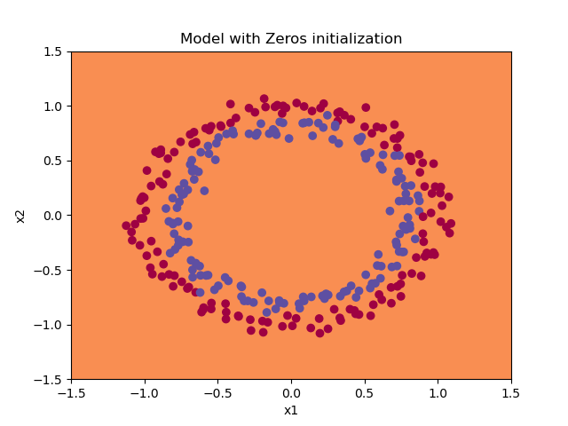

# Improving Deep Neural Networks

In this repository, we implement and test several tools for making deep neural networks more efficient.

## Initialization

First, we check the performance of three kinds of parameter initialization: zeros, large random numbers, and He initialization.

 

## Regularization

Then, on a second dataset, we check the performance of two kinds of regularization: L2 regularization and dropout.

 

